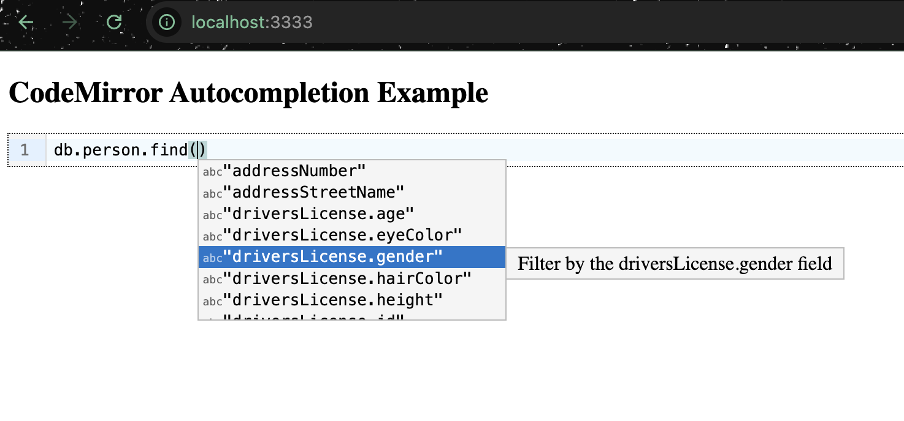

# CodeMirror Autocompletion Example

A _sidecar_ project to create a working auto suggestions for a **very limited** subset of [MongoDB Shell](https://www.mongodb.com/docs/mongodb-shell/) commands. It only supports enough commands to solve the [MongoDB Murder Mystery](https://mongomurdermystery.com/walkthrough) game.

It uses [CodeMirror v6.x Autocompletion](https://codemirror.net/examples/autocompletion/) feature, which is also what [MongoDB Compass](https://www.mongodb.com/docs/compass/current/) uses behind the scenes to support the query builder suggestions as well as other parts the tool.

## To Run

- Have a terminal running: `npm start`
- Everytime the code is changed, re-bundle via: `npx webpack --mode development`
- Open/Refresh `http://localhost:3333`
- Type 'd' in the text area to see the initial set of suggestions.
- Enjoy!
